## Installation
---
1: Sign Up
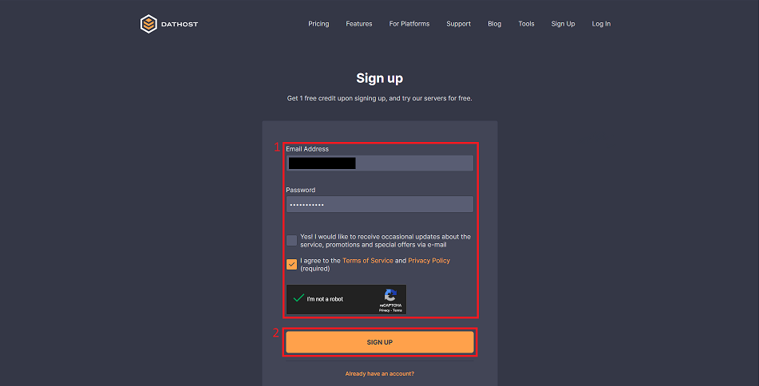
1. On <a href="https://dathost.net/sign-up" target="_blank">dathost.net</a> add your login information
2. Sign up
---
2: Select Game
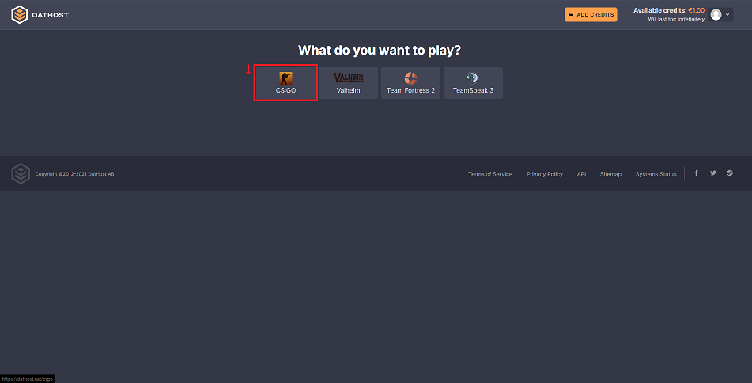
1. Select CS:GO
---
3: Select Type
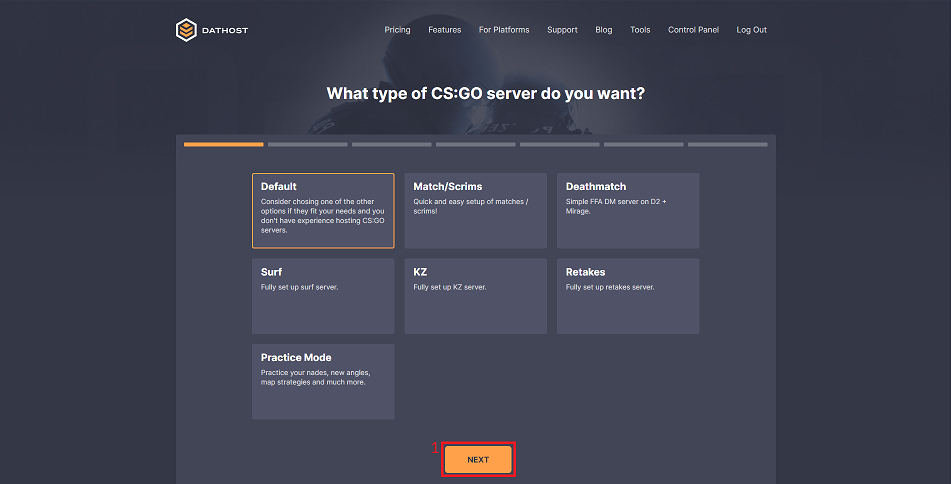
1. Next
---
4: Number of slots
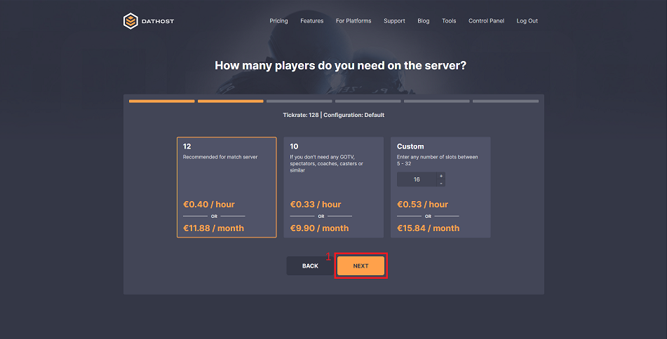
1. Next
---
5: Set Name and Password
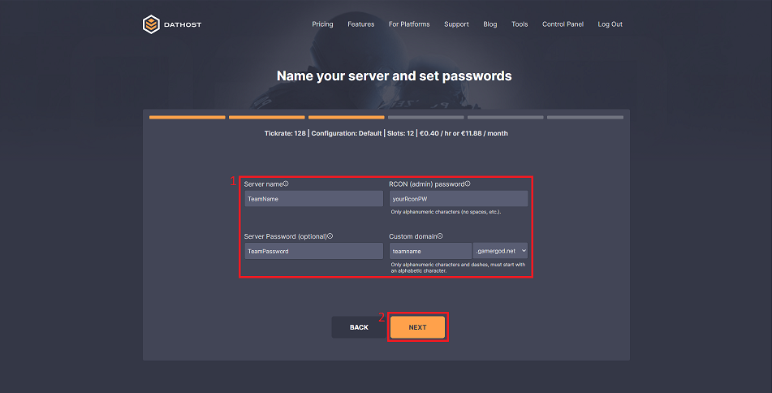
1. Configure your server name and passwords
2. Next
---
6: Set Server Location
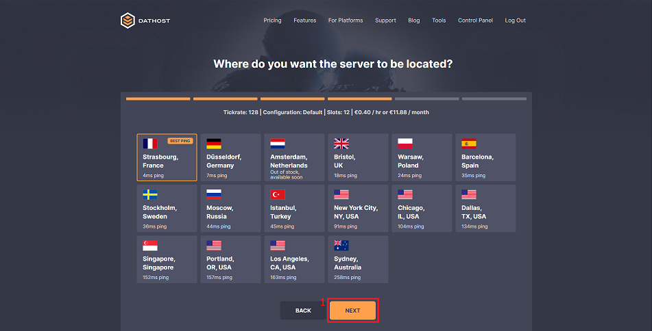
1. Next
---
7: Set GSLT
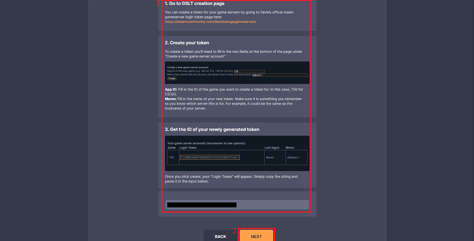
1. Follow the instructions on the website
2. Next
---
8: Add credit
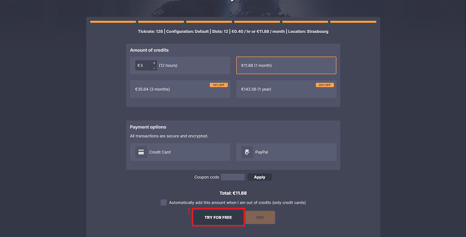
1. Try for free (you can easily add money later)
---
9: Edit the Server
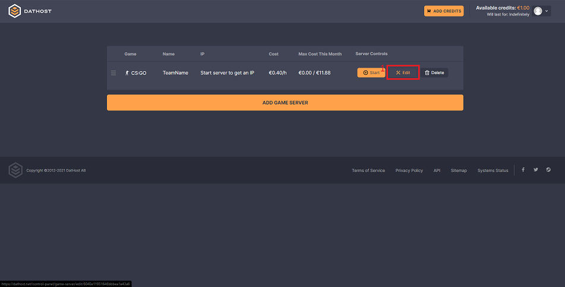
1. Click 'Edit' on the server you just created
---
10: Edit Advanced settings
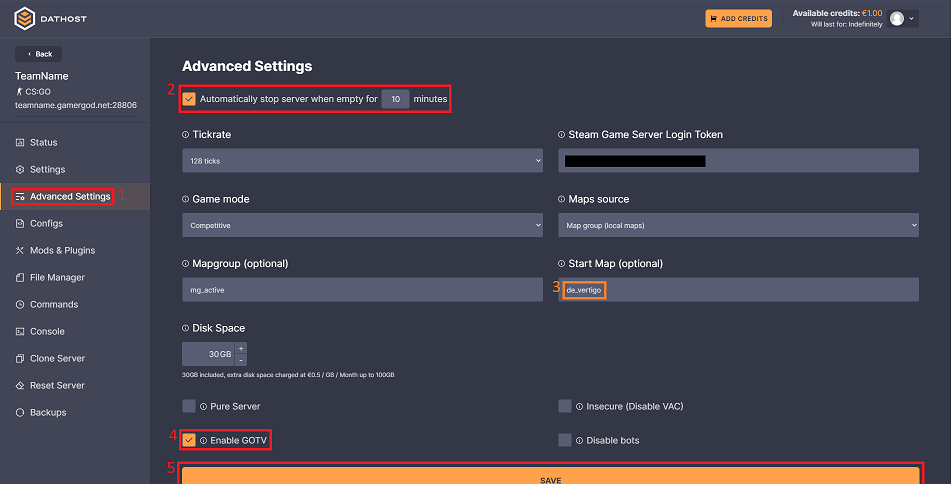
1. Select 'Advanced Settings'
2. Configure the server to stop running when it is empty (saves you quite some money)
3. Change the map the server starts on
4. Enable GOTV
5. Save the changes
---
11: Mods&Plugins
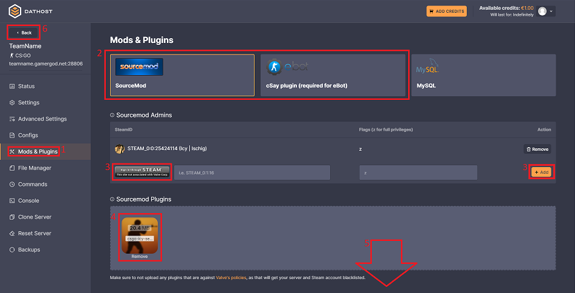
1. Select 'Mods&Plugins'
2. Activate SourceMod and Deactivate cSay
3. Add yourself as an Admin by adding your information and clicking add(add your teammates by adding their steamIDs [steamIDfinder](https://steamidfinder.com/))
4. Download the custom configuration <a href="https://github.com/IcyJan/csgo-server-config/archive/master.zip" target="_blank">here</a> and then upload it by drag and drop to your server
5. After the upload finished save the changes at the bottom
6. Go Back to the overview
6. And start your server
---